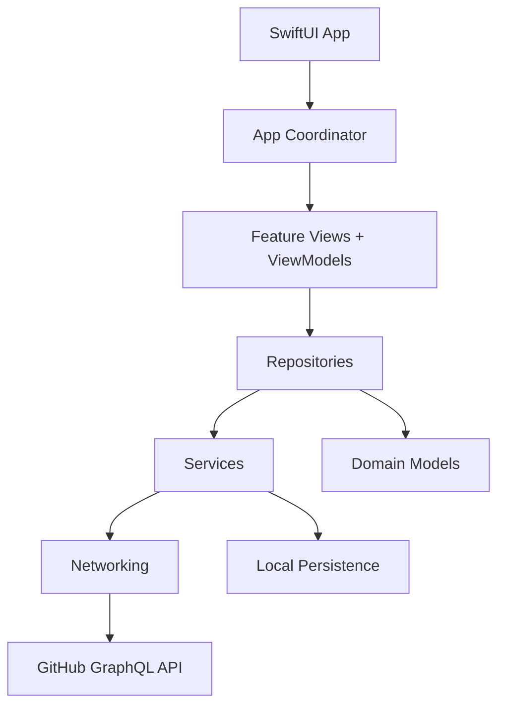

# DevHub - AI Developer Workspace

DevHub is a native iOS workspace for software engineers who move between repositories, pull requests, reviews, issues, CI status, and team context all day. The product goal is a focused internal productivity app: dense enough for working engineers, but calm, accessible, and unmistakably native.

## Build Strategy

This repository is being built in commit-sized production increments instead of one large code drop.

1. Foundation
2. Networking layer
3. GitHub authentication
4. GitHub GraphQL
5. Dashboard
6. Repository features
7. Pull request module
8. AI review assistant
9. Offline persistence
10. Testing
11. CI/CD
12. Accessibility
13. Performance
14. WidgetKit
15. App Intents
16. Documentation

## Architecture

DevHub uses MVVM with a coordinator boundary for navigation, protocol-oriented services, repository abstractions for data access, Swift Concurrency for async work, and dependency injection through an application environment.



## Folder Structure

```text
DevHub/
  App/
  Core/
    DependencyInjection/
    Navigation/
    State/
  Configuration/
  Networking/
  Models/
  Services/
  Features/
  Repositories/
  Utilities/
  Components/
  Resources/
DevHubCore/
  Sources/
  Tests/
fastlane/
.github/workflows/
Documentation/
```

`DevHub/` contains native iOS application code. `DevHubCore/` contains pure Swift architecture primitives that can be validated with Swift Package Manager while the iOS scheme is developed.

## Requirements

- Swift 6
- Xcode 16 or newer for iOS builds
- iOS 17 or newer target
- GitHub OAuth app credentials for authenticated API features

## Current Status

Completed:

- Step 1: product direction and repository foundation
- Step 2: production folder structure
- Step 3: coordinator boundary, feature state model, and dependency registration conventions
- Step 4: remaining foundation configuration, logging, linting, and formatting policy

## Planned Phases

- WidgetKit summaries for assigned reviews
- App Intents for opening repositories and PRs
- Push notification integration for review requests
- Local semantic cache for AI-generated review summaries
- Multi-provider integrations for Jira, Slack, and CI vendors
