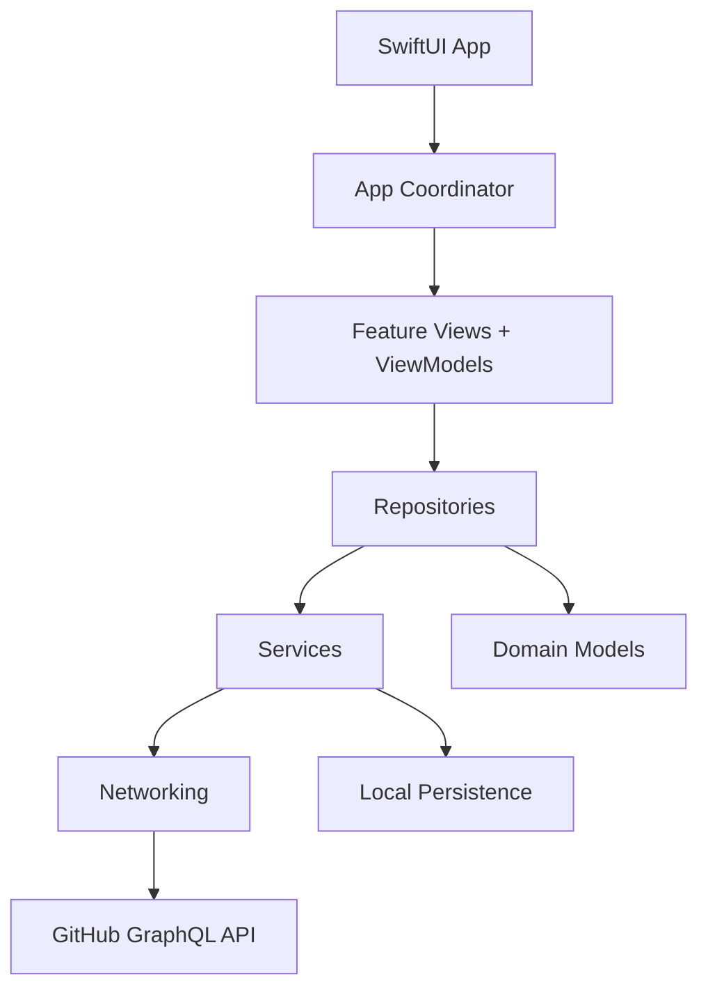

# DevHub - AI Developer Workspace

DevHub is a native iOS workspace for software engineers who move between repositories, pull requests, reviews, issues, CI status, and team context all day. The product goal is a focused internal productivity app: dense enough for working engineers, but calm, accessible, and unmistakably native.

## Build Strategy

This repository is being built in commit-sized production increments instead of one large code drop.

1. Foundation and folder structure
2. App architecture and dependency injection
3. Generic networking layer
4. GitHub authentication and Keychain storage
5. GitHub GraphQL client
6. Dashboard
7. Repository search and favorites
8. Pull request workflows
9. AI review module
10. Offline persistence
11. Tests, mocks, and UI tests
12. CI/CD, Fastlane, polish, and release hardening

## Architecture

DevHub uses MVVM with a coordinator boundary for navigation, protocol-oriented services, repository abstractions for data access, Swift Concurrency for async work, and dependency injection through an application environment.



## Folder Structure

```text
DevHub/
  App/
  Core/
    DependencyInjection/
    Navigation/
  Networking/
  Models/
  Services/
  Features/
  Repositories/
  Utilities/
  Components/
  Resources/
DevHubCore/
  Sources/
  Tests/
fastlane/
.github/workflows/
```

`DevHub/` contains native iOS application code. `DevHubCore/` contains pure Swift architecture primitives that can be validated with Swift Package Manager while the iOS scheme is developed.

## Requirements

- Swift 6
- Xcode 16 or newer for iOS builds
- iOS 17 or newer target
- GitHub OAuth app credentials for authenticated API features

## Current Status

Step 1 is the production foundation: repository structure, project direction, baseline architecture contracts, and a testable Swift package for core dependency injection.

## Future Improvements

- WidgetKit summaries for assigned reviews
- App Intents for opening repositories and PRs
- Push notification integration for review requests
- Local semantic cache for AI-generated review summaries
- Multi-provider integrations for Jira, Slack, and CI vendors
